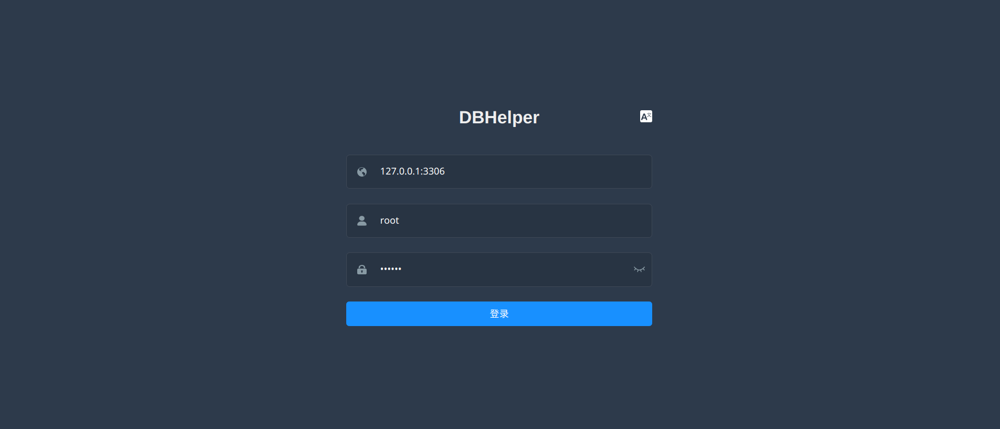
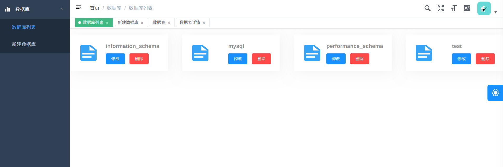
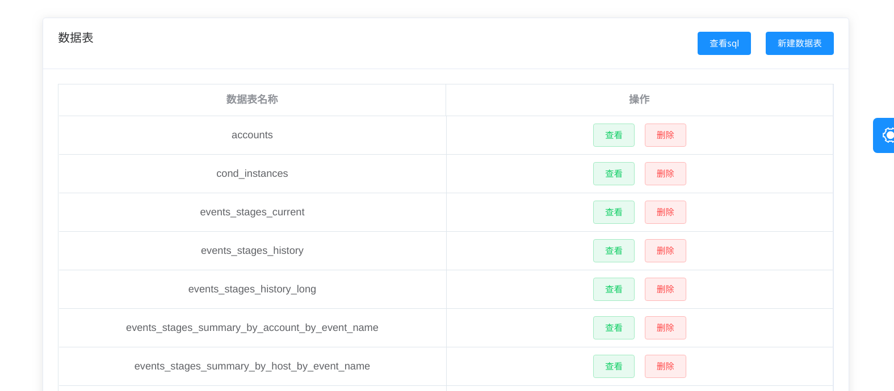
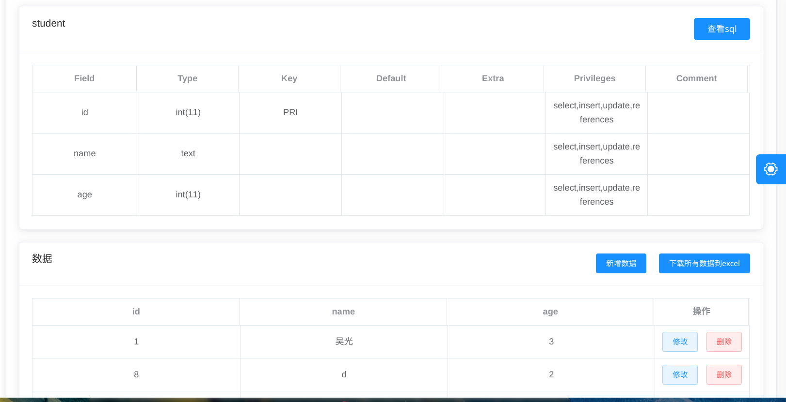
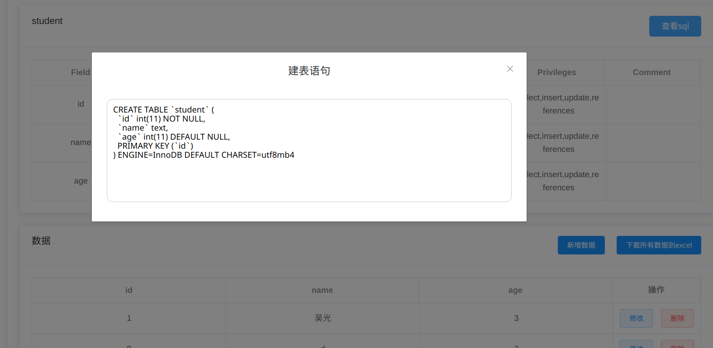

# DBHelper　mysql图形管理工具
采用Springboot + Vue开发的mysql可视化管理工具，使用它可以用图形界面完成增删查改等常用的数据库操作。

## 项目文件目录结构
```
--|--dbhelper(后端文件)--src--|--main--|--java // java代码
  |                          |        |--resources // 静态资源，存放打包后的前端文件
  |                          |--test //测试代码   
  |--dbhelper_fe // 使用Vue编写的前端源代码
  |--doc // 文档目录
  |--dbhelper-1.0.0.jar // 可直接运行的jar包         

```

## 如何使用
有两种使用方式，一种是直接运行jar包，另一种是使用idea或者eclipse运行dbhelper文件夹下的后端项目。

### 直接使用
下载dbhelper-1.0.0.jar,在jar包所在的目录下运行
```
java -jar dbhelper-1.0.0.jar
```
启动成功后使用浏览器访问localhost:8080即可看到登录页面。

### 部分软件效果展示
> 创建链接  



> 数据库列表页  



> 查看数据库包含的数据表  



> 记录的增删改查  



> 查看sql  

